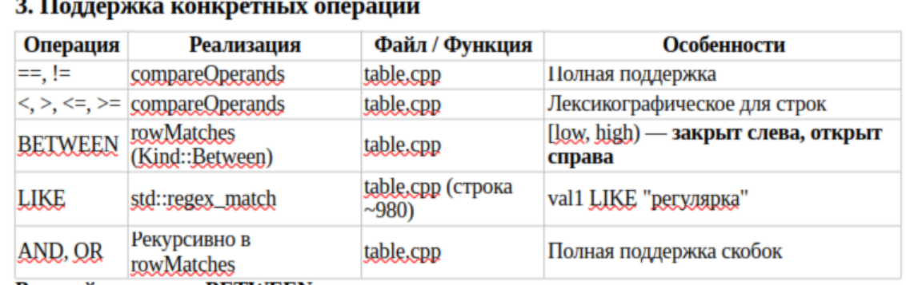

# Файл с ответами на основные вопросы

## 1. Синтаксис языка запросов

### 1. Команды могут занимать несколько строк и завершаются символом ;
```
utils.cpp / splitStatements()
```

### 2. Ключевые слова регистронезависимы (без смешения регистров в одном слове)
```
utils.cpp / toUpper()
lexer.cpp / consumeIf(), expectWords()
parser.cpp / все проверки ключевых слов
```

### 3. Строковые литералы заключаются в двойные кавычки (")
```
lexer.cpp / Lexer::Lexer()
```

### 4. Правила имён сущностей (БД, таблиц, колонок)
```
utils.cpp / isValidIdentifier()
```

### 5. Обращение к таблицам: database_name.table_name или через USE
```
Реализация: parser.cpp Parser::parseTableName()
Использование: dbms.cpp 
        resolveDataBaseName() - выбирает способ открытия таблицы
        requireDataBaseFromTableName() - открывает нужную базу данных

USE реализовано в dbms.cpp / DBMS::executeUseDatabase()
```

**Общая схема обработки SQL-текста**
```
Многострочный текст
    ↓
splitStatements()                  // utils.cpp
    ↓
Lexer (токенизация)                // lexer.cpp
    ↓
Parser::parseStatement()           // parser.cpp
    ↓
DBMS::execute()                    // dbms.cpp
    ↓
Table / Database / Auth и т.д.
```

## 2. Работа с метаданными СУБД

### 1. Парсинг команд

```
parser.cpp / Parser::parseStatement()
```

### 2. Диспетчеризация выполнения
```
dbms.cpp / DBMS::execute()
```

### 3. Основная реализация
```
dbms.cpp / DBMS::execute<название команды>
```

### 4. Вспомогательные алгоритмы
```
dbms.cpp /
    databasePath() - формирует путь
    resolveDataname() - определяет, какую базу использовать
    requireDataFromTableName() - открывает базу данных для операций с таблицами
    metadataMutex() - глобальный мьютекс
```

### 5. Поток выполнения (пример)
```
CREATE DATABASE testdb;
SQL → Lexer → Parser::parseStatement() → CreateDatabaseCommand
    → DBMS::execute() → executeCreateDatabase()
        → metadataMutex()
        → create_directories("data/testdb")
        → "OK: база данных создана: testdb"

USE testdb;
→ Parser → UseDatabaseCommand
    → DBMS::executeUseDatabase()
        → currentDatabase_ = "testdb"

DROP DATABASE testdb;
→ Parser → DropDatabaseCommand
    → DBMS::executeDropDatabase()
        → remove_all("data/testdb")
        → если нужно — сброс currentDatabase_
```

## 3. Работа со схемами данных (DDL)

### 1. Парсинг команд
```
CREATE TABLE parser.cpp / Parser::parserCreateTable()
DROP TABLE parser.cpp / Parse::parseStatement()
```

### 2. Диспетчеризация выполнения
```
dbms.cpp / DBMS::execute()
```

### 3. Основная реализация
```
table.cpp 
CREATE_TABLE: Table::create()
DROP TABLE: Table::drop()
```
**Вспомогательные компоненты**
```
storage.cpp / schemaToPhotoBytes() - сериализация схемы в photobuf
storage.cpp / schemaFromPhotoBytes() - дессериализация
table.cpp / loadSchema() + validateSchema() - загрузка и открытие схемы при открытии таблицы
table.cpp / buildIndexes() - создание объектов DiskBStarIndex()
table.cpp / persistIndexesFromRows() - перестройка индексов при необходимости
```

## 4. Манипулирование данными (DML)

### 1. Парсинг команд
```
parser.cpp / 
    INSERT: Parser::parseInsert()
    UPDATE: Parser::parseUpdate()
    DELETE: parseDelete()
    SELECT: parseSelect() + parseSelectItem()
```

### 2. Диспетчеризация
```
dbms.cpp / DBMS::execute()
```

### 3. Основная реализация
```
table.cpp
```

### 4. Важные механизмы
```
Хранение строк: storage.cpp / rowToPhotoBytes() + rowFromPhotoBytes()
Переиспользование места: tryWriteRowToFreeSlot() + appendDeletedOffset
Индексы: diskbstarindex.cpp 
Блокировка: tablelock.cpp - мьютекс на каждую таблицу
Логирование: runner.cpp + logger.cpp  
```


## 5. Где и как реализованы условия выборки (WHERE condition)

### 1. Парсинг условий
```
parser.cpp /
    Parser::parseWhereExpression() - входная точка
    parseOrExpression()
    parseAndExpression()
    parsePrimaryExpression()
    parsePredicate()

```

### 2. Вычисление условий
```
table.cpp /
    Table::rowMatches() - решаеТ. подходит ли строка под условие
    Table::resolveOperand() - берёт значение из строки по имени столбца
    Table::compareOperands() - сравнение реализовано здесь
        для INT числвоое
        для STRING - лексикографическое
    
```




### 3. Оптимизация через индексы
```
Файл: table.cpp
Функции:
    • tryUseIndex() (строки ~1020–1070) 
    • tryUseIndexForCompare() 
    • tryUseIndexForBetween() 
Что поддерживается индексами:
    • column = const 
    • column > const, column >= const 
    • column < const, column <= const 
    • column BETWEEN const1 AND const2 
```

### 4. Валидация условий
```
table.cpp / validateCondition(const Expr& expr)
```

### 5. Общая схема обработки WHERE
```
SQL → Parser::parseWhereExpression() → Expr (AST)
         ↓
    DBMS::executeSelect/Update/Delete
         ↓
   Table::selectRows / updateRows / deleteRows
         ↓
   indexedCandidateOffsets() → попытка использовать индекс
         ↓
   rowMatches() для каждой строки (или отфильтрованных)
```